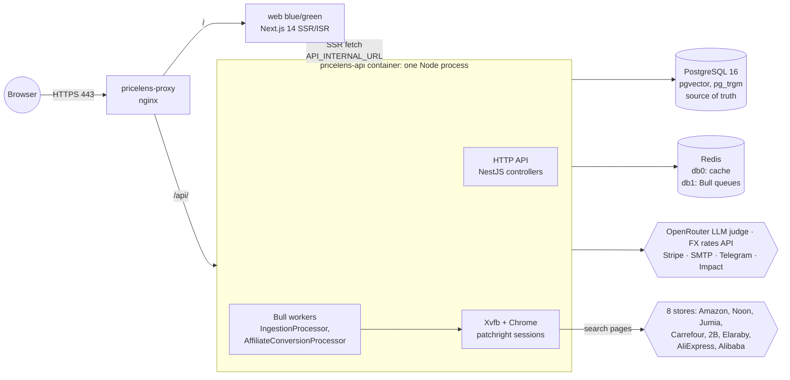
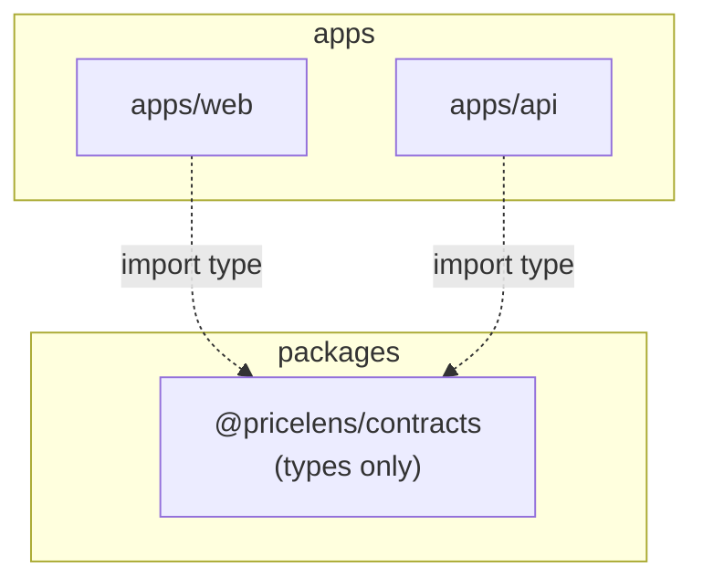
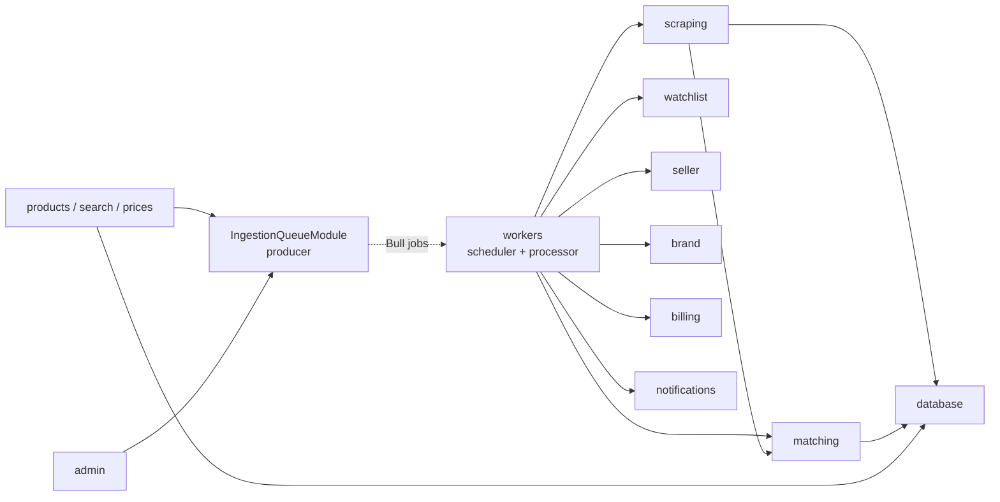
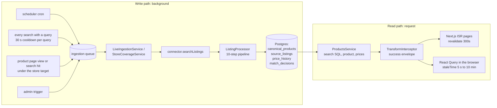
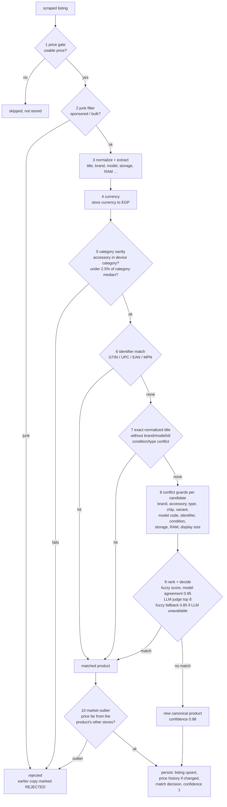
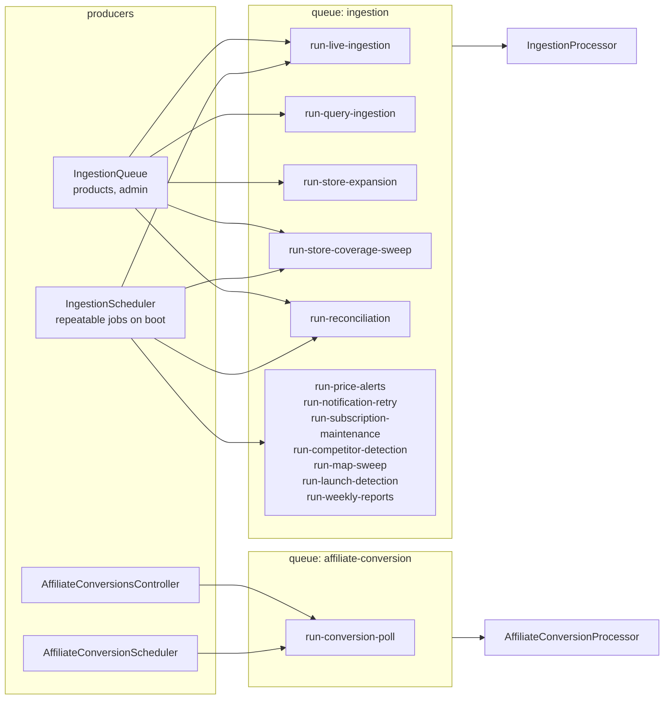
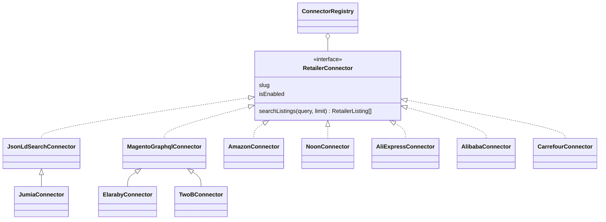

# PriceLens architecture

How the system is put together, as of phase 01 (2026-09-25). It describes the code as it is; decisions and their reasons are in [`docs/adr/`](docs/adr/). For commands and setup see the [README](README.md); for a file-level map see [PROJECT_MAP.md](PROJECT_MAP.md).

## 1. System



- **One process** runs HTTP and every background job, next to a headful Chrome (ADR 0004). A long scrape shares CPU and memory with request handling.
- **Postgres is the only store of record**, and search runs there too (ADR 0003). There is no search engine.
- **Redis** holds the cache (db 0, entitlements only) and the Bull queues (db 1).

## 2. Code layout



Apps depend on packages, never the reverse. `@pricelens/contracts` is declaration files only (ADR 0002): the response envelope, the error codes, pagination and the price responses. Both apps import it with `import type`, so it has no runtime presence.

### API modules



| Module | Owns |
|---|---|
| `matching/pipeline` | The 10 matching steps as pure functions, their types and thresholds (section 4) |
| `matching` | Normalizer, fuzzy matcher, LLM judge (`SemanticService`), FX rates, duplicate reconciliation |
| `scraping/connectors` | One `RetailerConnector` per store, and `ConnectorRegistry` |
| `scraping/ingestion` | `ListingProcessor` (runs the pipeline and persists), `IngestionRepository` (all ingestion SQL), pure query builders, the connector circuit breaker |
| `scraping` | `LiveIngestionService` (scheduled sweep, on-demand query run, cross-store backfill), `StoreCoverageService` (per-product expansion, coverage sweep) |
| `workers` | The `ingestion` queue contract (`ingestion.jobs.ts`), its producer (`IngestionQueue`), scheduler and processor |
| `products`, `search`, `prices` | Catalog reads: search SQL, product pages, price history |
| `billing`, `watchlist`, `notifications`, `intelligence`, `deal-hunter`, `seller`, `brand`, `public-api`, `affiliate`, `auth`, `admin` | Product features |
| `common` | Guards, decorators, the response interceptor, `ApiExceptionFilter`, `AppException` |
| `config` | One `registerAs` file per area, validated at boot by a zod schema (`env.validation.ts`) |

Layering: controllers do HTTP only; services own business rules and data access through Prisma. No controller touches Prisma (checked in phase 01).

## 3. Data flow



- **Source of truth:** Postgres. A listing's price is converted to the base currency (EGP) once, at ingestion (`priceUsd` column, a historical name); the store's raw amount is kept next to it (`rawPrice`/`rawCurrency`).
- **Price history:** one row per listing per price *change* (an unchanged price writes nothing).
- **Colors** of one model/storage/RAM share one canonical product (owner decision D-6); each offer row carries its own title, so a color filter can be built on the offer rows later (phase 06).
- **Caching and invalidation:**

| Where | What | Invalidated by |
|---|---|---|
| Redis db 0 | Entitlements per user, 60 s | TTL, and `EntitlementsService.invalidate()` on every billing write |
| In-process | FX rate table (12 h), category median price (1 h) | TTL |
| Next.js | Home and product pages (ISR 300 s), sitemap (6 h) | TTL only |
| Browser | React Query per hook, `staleTime` 5 s to 10 min | TTL, and mutations invalidate their own keys |

  Nothing caches prices on the server, so a changed price is visible on the API at once and on server-rendered pages within 5 minutes. There is no event-driven invalidation (a phase 08 option: revalidate a product page when ingestion changes its price).

## 4. Matching pipeline

Every scraped listing goes through ten steps (`apps/api/src/matching/pipeline`). Each step is a pure function with explicit input and output types; the three that need I/O take it as a parameter (FX conversion) or a port (`CandidateSource`, `SameProductJudge`). `ListingProcessor` runs them in order and persists the result. All thresholds are in `pipeline/thresholds.ts`.



Guarantees and known gaps:

- **Behavior is pinned** by `test/e2e/matching-characterization.e2e-spec.ts`: about 60 listings through the real pipeline and database, snapshotting where each one lands. A refactor must leave the snapshot unchanged; a deliberate matching change updates it, and the diff is the review. Each step also has unit tests (`test/unit/matching-pipeline.spec.ts`).
- **Ties:** candidates come from an unordered query (`findMany`, 200 per category) and the ranking sort is stable, so equal scores go to whichever row Postgres returns first. This bites when a title's RAM can't be read (F-17, phase 02).
- **Duplicate reconciliation** (`ReconciliationService`, hourly) re-checks stored products with its *own* guard list, which differs from step 8 (it treats color as a conflict, and skips the product-type and chip guards). Phase 02 aligns them.

## 5. Queues and jobs

Bull 4 (`@nestjs/bull`) on Redis db 1. Two queues.



| Job | Trigger | Dedup id | On completion |
|---|---|---|---|
| run-live-ingestion | cron `LIVE_INGESTION_CRON` (0 */6 * * *), admin | `scheduled-live-ingestion` / `manual-live-fetch:<stores>` | kept (last 100) / removed |
| run-query-ingestion | every search with a non-empty query (30 s per-query cooldown, in process) | `on-demand-live-fetch:<query>` | removed |
| run-store-expansion | product page view, or a search hit, below `MIN_STORES_PER_PRODUCT` stores (30 s per-product cooldown) | `store-expansion:<productId>` | removed |
| run-store-coverage-sweep | cron `STORE_COVERAGE_SWEEP_CRON` (0 */6 * * *), admin | `scheduled-…` / `manual-…:<ts>` | kept / removed |
| run-reconciliation | cron `RECONCILIATION_CRON` (0 * * * *), admin | `scheduled-…` / `manual-reconcile:<ts>` | kept / removed |
| run-price-alerts, -notification-retry, -subscription-maintenance, -competitor-detection, -map-sweep, -launch-detection, -weekly-reports | cron each (see `.env.example`) | `scheduled-<name>` | kept |
| run-conversion-poll | cron `AFFILIATE_CONVERSION_POLL_CRON`, admin | `scheduled-…` / per request | kept |

- **Contract:** `workers/ingestion.jobs.ts` holds the queue name, job names and payload types. Producers and the processor depend on it; nothing depends on the processor.
- **Retries:** every job gets 3 attempts with exponential backoff from 5 s (`BullModule.forRoot` defaults).
- **Dead letters:** there is no separate dead-letter queue. A scheduled job that fails 3 times stays in the queue's failed set (last 50 kept). On-demand jobs are removed even when they fail: they are triggers, and the next search or page view triggers again.
- **Idempotency:** ingestion upserts listings by (platform, external id) and writes price history only on change, so re-running a scrape is safe; match decisions are an append-only log. The operational jobs document their own idempotency (dedupe keys, "one violation per product/retailer/day").
- **Concurrency:** Bull starts one processing loop per `@Process` handler, and each loop takes the next job of any name. With 12 handlers, up to 12 ingestion-queue jobs run at once: a live sweep, a coverage sweep and several on-demand scrapes can compete for the same browser. The coverage sweep guards against overlapping itself; nothing else does. This is a known limit (phase 08/10).
- **Scheduling:** on boot the scheduler removes every repeatable job on its queue and re-adds the enabled ones, so the crons always match the current config. `LIVE_INGESTION_SCHEDULE_ENABLED=false` skips all of them, not only ingestion (phase 03 handoff).

## 6. Store adapters



Adding a store: implement `RetailerConnector` (usually by extending one of the two base connectors), add the class to `CONNECTOR_CLASSES` in `scraping/connectors/connector.registry.ts`, add its `*_ENABLED`/`*_BASE_URL` config, and a `platforms` row with the same slug. Nothing in the ingestion core names a store.

## 7. Errors and responses

Every response has one of two shapes, defined in `@pricelens/contracts`:

```jsonc
{ "success": true,  "data": { /* ... */ }, "meta": { /* optional */ } }
{ "success": false, "error": { "code": "UPGRADE_REQUIRED", "message": "...", "details": { /* ... */ },
                               "requestId": "...", "timestamp": "...", "path": "/api/v1/..." } }
```

- `TransformInterceptor` wraps successes. `ApiExceptionFilter` (catches everything) produces the error shape (ADR 0005).
- `code` is stable and machine-readable (`ApiErrorCode`). HTTP errors map by status; a domain exception's own `code` wins (`UPGRADE_REQUIRED`, `QUOTA_EXCEEDED`, `CORS_ORIGIN_NOT_ALLOWED`), and its extra fields become `details`. Validation errors put the messages in `details`. Unknown errors are a 500 `INTERNAL_ERROR` that reveals nothing; the stack goes to the log.
- New domain errors extend `AppException(status, code, message, details)`.

## 8. Configuration

- One file per area in `apps/api/src/config` (`registerAs`), loaded by `ConfigModule` and validated at boot by the zod schema in `env.validation.ts`, which lists every problem and refuses to start.
- `.env.example` documents every variable the apps read; a unit test fails when code reads an undocumented one.
- Consumers read by string key (`config.get<number>('retailers.minStoresPerProduct', 7)`), so a mistyped key silently returns the default. Typed config access is a phase 03 item.
- Dev (`.env.development`) and tests (`.env.test`) turn off every store connector, scheduled scrape and paid API.
