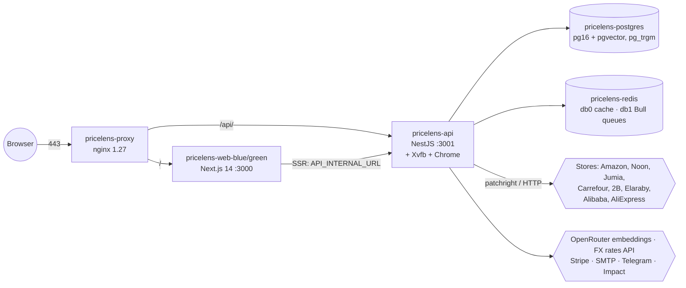

# PriceLens — Project map

Written in phase 00 (2026-09-25) from the code at tag `phase-00-start`, updated in phase 01. Describes what exists, not what is intended. How the parts work together (data flow, matching pipeline, queues) is in [ARCHITECTURE.md](ARCHITECTURE.md).

## System

## Repo layout

| Path | What |
|---|---|
| `apps/api` | NestJS 10 API **and** the Bull workers (same process). Prisma 5.22. ~19.4k lines of TS in `src`. |
| `apps/api/prisma` | `schema.prisma` (1,143 lines), 11 migrations, `seed.ts` → `seed/seed.ts` |
| `apps/api/seed` | Synthetic catalog generator (profiles demo/medium/full), `purgeDemoProducts.ts`, affiliate config seed |
| `apps/api/scripts` | 23 one-off ops/diagnostic scripts (backfills, merges/unmerges, store probes, captcha solve). Not wired to any package script except `login-store.ts`. |
| `apps/api/test` | 21 unit specs (Jest), 2 integration specs (need a real DB) |
| `apps/web` | Next.js 14.2 App Router, React Query, Zustand, Tailwind, Recharts. ~9.6k lines. Vitest component tests, Playwright smoke tests. |
| `packages/contracts` | `@pricelens/contracts`: response envelope, error codes, pagination, price responses. Declaration files only (ADR 0002). |
| `docs/adr` | Architecture decision records |
| `docker/` | `Dockerfile.api`, `Dockerfile.web`, `entrypoint.api.sh` (Xvfb, optional noVNC, `migrate deploy`), `nginx.prod.conf`, `nginx-upstreams/` (untracked, generated) |
| `scripts/` | `deploy-api.sh`, `deploy-web.sh` (blue/green), `sync-web-upstream.sh`, `renew-cert.sh`, `sync-push.sh`, `init-db.sql` |
| `docker-compose.yml` | Dev infra (Postgres, Redis), compose project `pricelens-dev`, 127.0.0.1 only |
| `docker-compose.server.yml` | What actually runs in prod on this server |
| `docker-compose.prod.yml` | Generic prod variant (not used here) |
| `prompts/`, `audit/` | Overhaul phase prompts and their audit reports |

## API modules (`apps/api/src`)

auth · products · search (controller only; delegates to `ProductsService`) · matching (`pipeline/`: the 10 matching steps; normalizer, fuzzy, semantic LLM judge, reconciliation, fx-rates) · scraping (8 store connectors + 2 base connectors, `ConnectorRegistry`, browser session, bot-wall; `ingestion/`: `ListingProcessor`, `IngestionRepository`; `LiveIngestionService`, `StoreCoverageService`) · workers (queue contract `ingestion.jobs.ts`, `IngestionQueue` producer, scheduler, processor) · prices · watchlist (+ price alerts) · admin · affiliate · billing (Stripe, plans, entitlements) · notifications (email, Telegram) · intelligence (price stats, deal score, fake-discount) · deal-hunter · seller · brand (MAP, distribution, launches, reports) · public-api (API keys) · common · config · database.

Search is Postgres (`ILIKE` + `pg_trgm` + scoring in `products.service.ts`); there is no search engine (ADR 0003). Every search with a query also enqueues a live scrape of that query (30 s cooldown per query).

## Background jobs (Bull, Redis db 1, registered in `workers/ingestion.scheduler.ts`)

| Job | Default cron |
|---|---|
| live ingestion | `0 */6 * * *` |
| reconciliation | `0 * * * *` |
| store coverage sweep | `0 */6 * * *` |
| price alerts | `*/30 * * * *` |
| notification retry | `*/15 * * * *` |
| subscription maintenance | `17 * * * *` |
| competitor detection | `45 */3 * * *` |
| MAP sweep | `50 */3 * * *` |
| launch detection | `20 */6 * * *` |
| weekly reports | `0 6 * * 1` |
| affiliate conversion poll | `0 */2 * * *` (queue `affiliate-conversion`) |

## Ports

| Where | Port | Service |
|---|---|---|
| prod host | 80, 443 | pricelens-proxy |
| prod host | 3002 → 3001 | pricelens-api (published on all interfaces) |
| prod internal | 3000 | web container |
| dev (`docker-compose.yml`) | 127.0.0.1:5432, 127.0.0.1:6379 | Postgres / Redis |
| dev | 3000 / 3001 | `next dev` / `nest start` |
| same host, not PriceLens | 3001 (aradobot-web), 4000, 27017, 8091, 11434 | other projects |

## Environment

Root `.env` is shared by api and web. `.env.example` documents every variable the code reads (enforced by a unit test). Groups: app/ports · DB/Redis · JWT · retailers (per-store `*_ENABLED`, crons, coverage) · FX · embeddings (`OPENAI_API_KEY` against OpenRouter) · billing (Stripe) · notifications (SMTP, Telegram) · affiliate (Impact, salts) · seed (`SEED_*`).

## Commands

| Command | Does | Caveat |
|---|---|---|
| `pnpm install` | install (pnpm 11.4.0 via `packageManager`) | host pnpm is 10.x; use `npx pnpm@11.4.0` |
| `pnpm typecheck` / `lint` / `build` / `test` | turbo pipelines (typecheck includes `@pricelens/contracts`) | api tests load `.env.test` and refuse non-`*_test` databases |
| `pnpm db:migrate` / `db:seed` | Prisma against root `.env` | root `.env` on the server is **production** |
| `pnpm dev:up` / `docker:up` / `docker:reset` | dev stack / dev infra (`pricelens-dev`) | `reset` deletes the dev volumes |
| `scripts/deploy-api.sh`, `scripts/deploy-web.sh` | build image, blue/green swap | |
